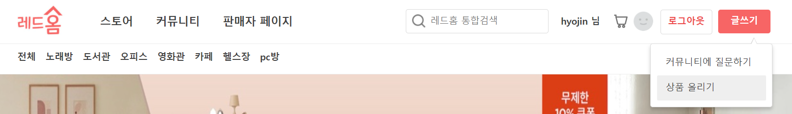

# readMe.md

# 레드홈(Layered Home) : 인테리어 상품 판매

---

단순 주거라는 집의 기본 역할에 일과 여가 등 새로운 기능들이 더한 공간으로의 진화라는 의미로 집의 변화를 나타내는 신조어 '레이어드 홈'

2021인테리어 트랜드로 떠오르는 '레이어드 홈'을 오늘의 집과 같은 인테리어 플랫폼에 접목 시켜

테마 별로 구분된 인테리어 상품을 구매 및 판매, 관리할 수 있는 웹 서비스 레드홈을 제작했습니다.

### 팀 구성 : 김준철  박효진  최정연  한성준

---

## 사용 기술 및 라이브러리

**Data Base**

- MySQL

**Back End**

- Java11
- Gradle
- Spring boot
    - Validation
- Mybatis

**Front End**

- Javascript, Ajax, Jquery
- API
    - 결제 - pgAPI
    - 공유 - SNS API
    - 차트 - google chart API
    - 주소 - Daum 우편번호 API
- Thymeleaf

**Cooperation**

- git , sourceTree
- slack, notion

---

## 요구사항

**회원**

- 회원가입
- 로그인 및 로그아웃
- 회원 탈퇴
- 회원정보 수정
- 내가 쓴 글 보기
- 내 주문 내역
- 판매자 권한 신청
- 회원 등급

**상품**

- 상품 등록
- 상품 리스트
- 장바구니 담기
- 상품 결제
- 리뷰
- 상품 문의

**커뮤니티**

- 질문 등록
- 질문 수정 및 삭제
- 댓글 달기
- 공유하기

**결제**

- 결제 시 포인트 적용
- 포인트 적립

**관리자**

- 회원 / 상품 / 주문 관리
- 판매자 권한 신청 승인
- 회원 / 상품 / 주문 통계

---

## ER Diargram

요구분석 사항 토대로 모델링 진행

[https://www.erdcloud.com/d/RyyET8f2ZA9siudLF](https://www.erdcloud.com/d/RyyET8f2ZA9siudLF)

---

## 구현 페이지

회원

- **회원가입**

---

- **로그인**

---

- **회원수정**

---

- **회원탈퇴**

---

- **내가 쓴 글 보기**

- **리뷰 작성**

 

상품

- **상품 등록**

- 상품 리스트 페이지

  
- 장바구니 담기

- 상품 결제

- 상품 리뷰

      
- 상품 문의 등록

- 상품 문의

- 공유하기

 

커뮤니티

- 커뮤니티 등록

- 커뮤니티 리스트

- 커뮤니티 상세 보기

- 커뮤니티 답변 등록

- 공유하기

 

판매자 페이지

- 판매자 권한 신청

- 판매자 권한 승인

- 내 판매 상품

- 내 상품 문의

- 주문 관리

- 상품 문의 답변하기

 

관리자 페이지

- 회원 관리 페이지
  

- 상품 관리 페이지

- 주문 관리 페이지

- 회원 통계

- 상품 통계

   
   
- 주문 통계

